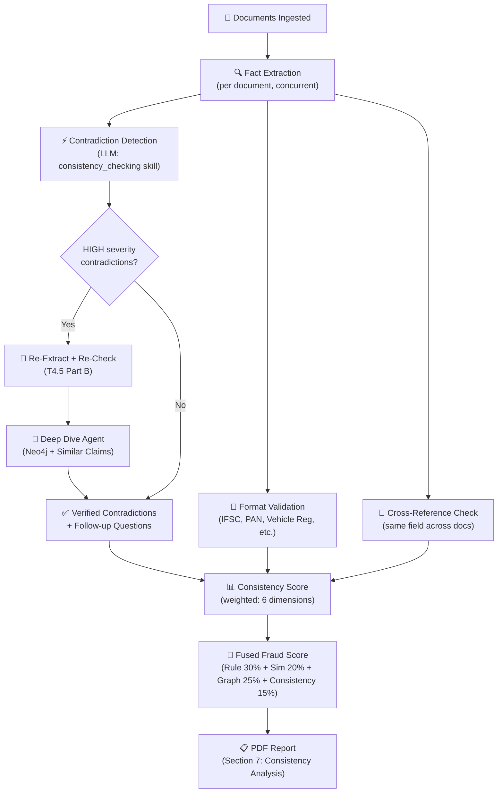

# BGIL SQC — Consistency Checking: Demo Brief

> **Purpose:** Quick reference for the client demo — lists every consistency checking capability **actually implemented in code**, with the brief logic behind each.

---

## 1. Six LLM-Powered Cross-Document Consistency Checkers

**Source:** [consistency.py](file:///c:/bgil-merged-2/src/sqc/tools/consistency.py)

The system runs **6 specialised consistency checkers in parallel** via `run_all_consistency_checks()`. Each checker sends the extracted facts from all claim documents to the LLM with a domain-specific prompt and returns a list of typed inconsistencies (HIGH / MEDIUM / LOW severity) plus a per-area score (0.0 – 1.0).

| # | Checker | Code ID | What It Catches |
|---|---------|---------|-----------------|
| 1 | **Date / Timeline Consistency** | `check_date_consistency` (WS6-001) | Timeline impossibilities (e.g., hospital admission before accident), suspicious gaps, date mismatches across documents, physically impossible event sequences |
| 2 | **Amount / Financial Consistency** | `check_amount_consistency` (WS6-002) | Amount mismatches across documents, inflated values vs. market rates, suspiciously round claim amounts, duplicate charges, policy limit violations |
| 3 | **Name / Entity Consistency** | `check_entity_consistency` (WS6-003) | Name mismatches beyond typos, vehicle registration number discrepancies, address inconsistencies, phone number anomalies, identity confusion (owner vs. driver vs. claimant) |
| 4 | **Cross-Reference Consistency** | `check_cross_reference_consistency` (WS6-004) | Policy number mismatches, claim number inconsistencies, DL vs. RC vs. claim form discrepancies, engine/chassis number mismatches, coverage vs. claim type mismatch |
| 5 | **Semantic / Narrative Consistency** | `check_semantic_consistency` (WS6-005) | Contradictory incident accounts, details that change between documents, physically implausible scenarios, damage-vs-incident mismatch |
| 6 | **Narrative Plausibility** | `check_narrative_plausibility` (T2.9) | Speed vs. injury severity mismatch, impact direction vs. damage pattern, claim amount vs. visible damage, weather/road conditions vs. accident type, unrealistic response times |

### Orchestration Logic

- All 6 run **concurrently** (controlled by `asyncio.Semaphore`, default 3 concurrent).
- Results are **combined, sorted by severity** (HIGH → MEDIUM → LOW).
- A **weighted overall consistency score** is computed:

  ```
  timeline: 20%  |  financial: 18%  |  entity: 22%
  cross_ref: 13% |  semantic: 12%   |  plausibility: 15%
  ```

- An automatic **recommendation** is generated based on severity counts:
  - `≥ 3 HIGH` → *"CRITICAL: Multiple high-severity inconsistencies. Field investigation strongly recommended."*
  - `≥ 1 HIGH` → *"WARNING: Desktop investigation recommended."*
  - `≥ 3 MEDIUM` → *"CAUTION: Further review recommended."*

- **Failed checkers are tracked** (`failed_checkers` list) so downstream knows which checks were skipped (T2.23).

---

## 2. Contradiction Detection Pipeline (Analysis Agent)

**Source:** [analysis.py](file:///c:/bgil-merged-2/src/sqc/agents/analysis.py) — `AnalysisAgent` class

The `AnalysisAgent` runs a **multi-phase consistency pipeline** as the core of the analysis workflow:

### Phase 1 — Fact Extraction
- Extracts atomic, verifiable facts from **every document** concurrently.
- Each fact includes: `fact_text`, `fact_type` (10 categories: PERSONAL_INFO, VEHICLE_INFO, FINANCIAL, DATE_TIME, LOCATION, INCIDENT, etc.), confidence score, entities, and source quote.
- Uses chunking with deduplication for long documents (T2.1).

### Phase 2 — Contradiction Detection + Rule Evaluation (Concurrent)
- **`_find_contradictions(facts)`** sends all extracted facts to the LLM (model: `pro`, temp: 0.1) using the `consistency_checking` skill prompt.
- Detects 6 contradiction types: `DATE_MISMATCH`, `AMOUNT_MISMATCH`, `IDENTITY_CONFLICT`, `VEHICLE_MISMATCH`, `LOCATION_CONFLICT`, `TIMELINE_ISSUE`.
- Each contradiction captures: the two conflicting facts, source documents, severity, and a description.
- Runs **concurrently** with rule evaluation.

### Phase 2.5 — Targeted Re-Extraction & Re-Check (T4.5 Part B)
- If **HIGH-severity contradictions** are found, the system:
  1. Identifies the **source documents** for each HIGH contradiction.
  2. **Re-extracts facts** from those documents only (caps at 5 docs for cost).
  3. **Re-runs contradiction detection** on the updated fact set.
  4. The LLM decides which contradictions **still hold** on fresh data — this becomes the authoritative list.
- Single-pass: never loops, so cost is bounded.

### Phase 2.6 — Contradiction Deep Dive Agent (T10.6)
- For any HIGH contradictions that **survive** the re-check, the system invokes the **`ContradictionDeepDiveAgent`**.
- This is a **LangGraph state-graph agent** that:
  - Searches for historically similar claims (`search_similar_claims`).
  - Traces graph connections via Neo4j (`neo4j_find_connected_claims`).
  - Re-extracts fields from specific documents for verification.
  - Produces a verdict: `REAL_FRAUD_SIGNAL`, `FALSE_POSITIVE`, or `NEEDS_MORE_EVIDENCE` with confidence.
  - Generates **targeted follow-up questions**.
- Capped at 5 iterations and 230s timeout; graceful fallback on failure.

**Source:** [contradiction_deep_dive_agent.py](file:///c:/bgil-merged-2/src/sqc/agents/contradiction_deep_dive_agent.py)

### Phase 3 — Question Generation
- Contradictions feed directly into **investigation question generation**.
- Questions are produced for each contradiction, each triggered rule, and each gap.
- Questions include: target (Claimant/Witness/Workshop/Hospital/Police), priority, rationale, expected evidence, and follow-up branches.

**Source:** [fact_extraction.py](file:///c:/bgil-merged-2/src/sqc/tools/fact_extraction.py) — `generate_investigation_questions()`

---

## 3. Heuristic Narrative Plausibility Checks

**Source:** [narrative_check.py](file:///c:/bgil-merged-2/src/sqc/tools/narrative_check.py)

A **rule-based (non-LLM) checker** that scores narratives from 100 downward with deductions:

| Check | What It Does | Deduction |
|-------|-------------|-----------|
| **Short narrative for high-value claim** | If narrative < 100 chars and claim > ₹1,00,000 | −15 pts |
| **Template / generic detection** | Detects boilerplate phrases ("as per the documents", "for your kind consideration", etc.) | −10 pts |
| **Vague time references** | Catches "some time ago", "recently", "a few days back" (≥ 2 occurrences) | −15 pts |
| **Missing dates** | Incident date in claim metadata but no dates in the narrative text | −5 pts |
| **Contradictory modifiers** | Detects paired contradictions: "minor damage" + "major accident", "slowly" + "high speed", "parked" + "driving", "empty road" + "heavy traffic" | −20 pts |
| **Fact disconnection** | Narrative doesn't mention any extracted facts — possible fabrication | −10 pts |

- Score < 50 → `plausible: false`.
- Also has an **LLM-enhanced version** (`check_narrative_plausibility_llm`) that combines heuristic + LLM scores, taking the minimum.

---

## 4. Format Validation & Cross-Reference Checks

**Source:** [validation/__init__.py](file:///c:/bgil-merged-2/src/sqc/tools/validation/__init__.py)

Deterministic (non-LLM) validators for **Indian document formats**:

| Validator | Format Checked | Key Logic |
|-----------|---------------|-----------|
| `validate_ifsc` | IFSC Code (11 chars: 4 alpha + '0' + 6 alphanum) | Regex + position-specific errors |
| `validate_pan` | PAN (10 chars: 5 alpha + 4 digit + 1 alpha) | Regex + holder type extraction (P=Individual, C=Company, etc.) |
| `validate_vehicle_registration` | Indian vehicle reg (e.g., MH-01-AB-1234) | Regex + state code lookup (37 states/UTs) + normalization |
| `validate_chassis` | VIN/Chassis (17 chars, ISO 3779) | Length + invalid char check (I/O/Q) + masking detection |
| `validate_uan` | UAN (12 digits) | Regex for EPFO format |
| `validate_mobile` | Indian mobile (10 digits, starts 6-9) | Country code removal + regex |
| `validate_aadhaar_last4` | Aadhaar last 4 digits | 4-digit regex |

### Arithmetic Verification
| Function | Purpose |
|----------|---------|
| `verify_arithmetic` | Checks if sum of components = expected total (e.g., Parts + Labour + Tax = Invoice Total) with configurable tolerance (default ₹0.01) |
| `verify_figures_vs_words` | Verifies "amount in figures" matches "amount in words" (common in Indian documents) using `parse_indian_amount` which handles ₹, lakh, crore notation |

### Cross-Reference Verification
| Function | Purpose |
|----------|---------|
| `check_cross_reference` | Checks if the **same field** (e.g., vehicle registration, claimant name, policy number) has **consistent values across all documents**. Normalizes values (uppercase, trim), groups by value, and reports conflicts with source documents. |

---

## 5. OCR Digit-Confusion Detection (T4.4)

**Source:** [consistency.py](file:///c:/bgil-merged-2/src/sqc/tools/consistency.py#L672-L757) — `is_digit_confusion()` and `find_digit_confusion_pairs()`

A deterministic utility that detects when two identifier strings (e.g., vehicle registration numbers from different documents) differ **only** by common OCR/VLM digit-letter confusions:

```
0 ↔ O, D, Q    |    1 ↔ I, l, |    |    2 ↔ Z
5 ↔ S           |    6 ↔ G, b  |    8 ↔ B
```

**Example:** `MH01AB1234` vs `MHO1AB1234` (0→O) → returns `True` (likely OCR error, not fraud).

- Used by the entity consistency checker to **downgrade severity** from HIGH to MEDIUM when a mismatch is likely an OCR artefact rather than a genuine contradiction.
- `find_digit_confusion_pairs()` scans a batch of identifier extractions for all such pairs.

---

## 6. Consistency Score Integration into Fraud Scoring

**Source:** [scoring.py (tools)](file:///c:/bgil-merged-2/src/sqc/tools/scoring.py) and [scoring.py (agent)](file:///c:/bgil-merged-2/src/sqc/agents/scoring.py)

### How Consistency Feeds the Final Fraud Score

1. **`calculate_consistency_score(contradictions)`** converts the list of contradictions into a 0-100 score:
   - Each HIGH = +25 pts, MEDIUM = +15 pts, LOW = +5 pts (capped at 100).

2. The **ScoringAgent** inverts this (high consistency = low risk):
   ```python
   consistency_risk = 100 - calculate_consistency_score(contradictions)
   ```

3. **`fuse_scores()`** combines 4 signals via weighted ensemble:
   ```
   Rule: 30%  |  Similarity: 20%  |  Graph: 25%  |  Consistency: 15%
   ```
   Plus max-aggregation boost (if any single signal > 80, boosts overall) and multi-signal amplification (≥ 3 signals > 60 → 15% boost).

4. Final score → risk category → recommended action:
   ```
   < 25 → NO_RISK → WAIVER
   25-44 → LOW → WAIVER (or DESKTOP if high-value)
   45-69 → MEDIUM → DESKTOP (or FIELD if high-value)
   ≥ 70 → HIGH → FIELD
   ```

### LLM Holistic Assessment (T11.1)
- `llm_fraud_score()` sends all component scores + contradictions + findings to the LLM for a holistic 4-dimension rubric assessment:
  - **Pattern Consistency** (0-25)
  - **Contradiction Severity** (0-25)
  - **Entity Risk** (0-25)
  - **Contextual Plausibility** (0-25)

---

## 7. Consistency Section in the Final PDF Report

**Source:** [report_generator.py](file:///c:/bgil-merged-2/src/sqc/tools/report_generator.py#L267-L279)

The generated PDF report includes a dedicated **"Consistency Analysis"** section (Section 7 of 11) that lists:
- Total contradictions found count.
- Each contradiction with its severity and description (up to 10).

---

## 8. Consistency-Related Fraud Rules (Rules Engine)

**Source:** [rules.py](file:///c:/bgil-merged-2/src/sqc/tools/rules.py)

Several fraud detection rules in the hardcoded rules engine directly target consistency:

| Rule ID | Rule Name | Type | Severity |
|---------|-----------|------|----------|
| `DOC_002` | Document Date Inconsistency | LLM | HIGH |
| `DOC_003` | Suspected Document Tampering | LLM | HIGH |
| `PER_001` | Claimant Address Mismatch | LLM | MEDIUM |
| `INC_003` | Vague Incident Description | LLM | MEDIUM |
| `INC_004` | Single Vehicle Damage Pattern | LLM | HIGH |
| `VEH_001` | High Mileage Discrepancy | LLM | MEDIUM |

Plus **77 CSV-loaded trigger groups** (from the BGIL trigger inventory) that are evaluated via batched LLM calls, many of which check consistency-related aspects.

---

## 9. Skill-Driven Consistency Prompts

**Source:** [skills/instructions/](file:///c:/bgil-merged-2/src/sqc/skills/instructions)

The following skill files guide the LLM's consistency analysis behaviour:

| Skill File | Used By | Purpose |
|------------|---------|---------|
| [consistency_checking.md](file:///c:/bgil-merged-2/src/sqc/skills/instructions/consistency_checking.md) | AnalysisAgent | Master consistency methodology — 6-step approach: Build Timeline → Verify Numbers → Match Entities → Examine Narrative → Check Physical Plausibility → Severity Classification |
| [cross_reference.md](file:///c:/bgil-merged-2/src/sqc/skills/instructions/cross_reference.md) | Cross-ref checks | Fact corroboration, entity linking, timeline reconstruction, amount cross-check across documents |
| [contradiction_deep_dive.md](file:///c:/bgil-merged-2/src/sqc/skills/instructions/contradiction_deep_dive.md) | ContradictionDeepDiveAgent | Guides the agent to investigate HIGH contradictions via tool calls, produce verdicts and follow-ups |

---

## Summary — What to Showcase in the Demo



> **Key talking points:**
> 1. **Multi-layered** — LLM-driven (6 parallel checkers) + heuristic (narrative plausibility, format validation) + deterministic (cross-reference, arithmetic, OCR digit-confusion).
> 2. **Self-correcting** — HIGH contradictions trigger re-extraction and a second consistency pass, plus an optional deep-dive agent that corroborates via historical data and graph connections.
> 3. **Quantified** — Every inconsistency is severity-classified, every dimension is scored, and the overall consistency score feeds directly into the fused fraud score with a 15% weight.
> 4. **Auditable** — All contradictions, their source documents, the conflicting values, and the reasoning are captured in the PDF report and API output.
> 5. **Domain-specific** — Tailored for Indian motor insurance: Indian date formats, lakh/crore amounts, state code validation, OCR digit-confusion maps, and insurance-specific rules.
